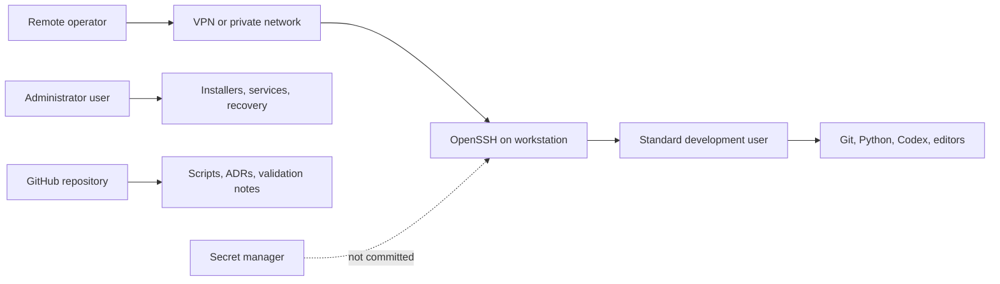

# Architecture

The workstation is designed around separated trust boundaries.

## Boundaries

- The standard user performs normal development and agent work.
- The administrator user is reserved for installation, recovery, and controlled system changes.
- Secrets are stored outside Git.
- Public documentation uses placeholders for host, account, path, and network identifiers.
- Remote access should be protected by a VPN or private overlay before SSH is reachable from outside the local machine.
