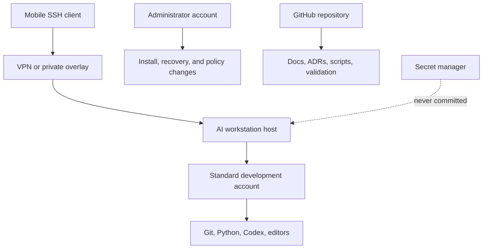

# AI Workstation

A public, privacy-safe blueprint for turning a Windows laptop into a remote AI engineering workstation with Git, PowerShell, OpenSSH, least-privilege accounts, and human-approved operational gates.

## Project Overview

This repository documents a staged workstation build. The goal is not to expose a machine to the internet quickly; it is to create a repeatable engineering environment where remote access, agent tooling, credentials, and recovery procedures have clear boundaries.

The public repository intentionally uses placeholders such as `<host>`, `<standard-user>`, `<project-root>`, and `<user-home>`. It does not publish real hostnames, account names, IP addresses, email addresses, SSH fingerprints, private keys, raw logs, or local filesystem paths.

## What This Demonstrates

This project is a workstation architecture and operations record, not a one-click installer. It demonstrates how to turn a personal machine into a more reliable AI engineering environment by making each risky boundary explicit before automation expands:

- identity and account separation before remote control;
- Git as the source of truth for non-sensitive configuration;
- staged OpenSSH rollout instead of direct exposure;
- privacy-safe documentation that remains useful to other engineers;
- human approval gates for administrator actions and security-sensitive changes.

For hiring managers and engineering reviewers, the repository is intended to show systems thinking, operational discipline, documentation quality, and security-aware AI tooling.

## Features

- Git-backed documentation and configuration records
- Platform-neutral roadmap for Windows, macOS, and Linux expansion
- Windows bootstrap scripts for time sync, standard-user setup, and OpenSSH rollout
- Secret hygiene tests that prove sensitive fixture files remain ignored
- Threat model, ADRs, setup notes, troubleshooting notes, and portfolio collateral
- Human-in-the-loop safety model for administrative and account-changing actions

## Tech Stack

- Windows 11
- PowerShell
- OpenSSH Server and Client
- Git and GitHub
- Markdown ADRs and runbooks
- Codex-assisted implementation with explicit human approval for risky actions

## Architecture



## Repository Structure

```text
.
|-- README.md
|-- ROADMAP.md
|-- ARCHITECTURE.md
|-- SECURITY.md
|-- bootstrap/
|   `-- windows/
|-- configs/
|-- docs/
|   |-- decisions/
|   |-- setup/
|   |-- security/
|   `-- troubleshooting/
|-- scripts/
`-- tests/
```

## Usage

1. Read `SECURITY.md` before enabling any remote access.
2. Review `ROADMAP.md` and complete the phases in order.
3. Use `docs/setup/phase-0-inventory.md` to record only privacy-safe inventory facts.
4. Run Windows bootstrap scripts only after reviewing their scope.
5. Keep secrets in a secret manager or local protected storage, never in Git.

## Validation

The repository includes lightweight checks that support safe publication and repeatable setup:

- secret hygiene fixtures under `tests/`;
- documentation boundaries in `SECURITY.md`;
- architecture decisions under `docs/decisions/`;
- staged setup records under `docs/setup/`;
- troubleshooting notes that preserve lessons without publishing raw local logs.

## Result

The current public record shows a workstation design with clear safety gates:

- a dedicated standard user for development work;
- administrator actions separated from agent work;
- OpenSSH installed and validated before external access is opened;
- password authentication deferred until public-key and network boundaries are ready;
- public documentation cleaned of local identifiers.

## Related Publication

- [Building a Secure Windows AI Workstation with Git, OpenSSH, and Human Approval Gates](https://medium.com/@seek1andfind2/%E6%88%91%E5%A6%82%E4%BD%95%E6%8A%8A%E4%B8%80%E5%8F%B0-windows-%E7%AD%86%E9%9B%BB-%E9%80%90%E6%AD%A5%E8%AE%8A%E6%88%90%E5%AE%89%E5%85%A8%E7%9A%84-ai-%E5%B7%A5%E7%A8%8B%E5%B7%A5%E4%BD%9C%E7%AB%99-5c9c646a0ffc)

## Future Improvements

- Add VPN overlay implementation notes
- Add SSH public-key rollout and password-authentication hardening
- Add mobile SSH client validation
- Add CI checks for secret and local-path leakage
- Extend bootstrap coverage to macOS and Linux
